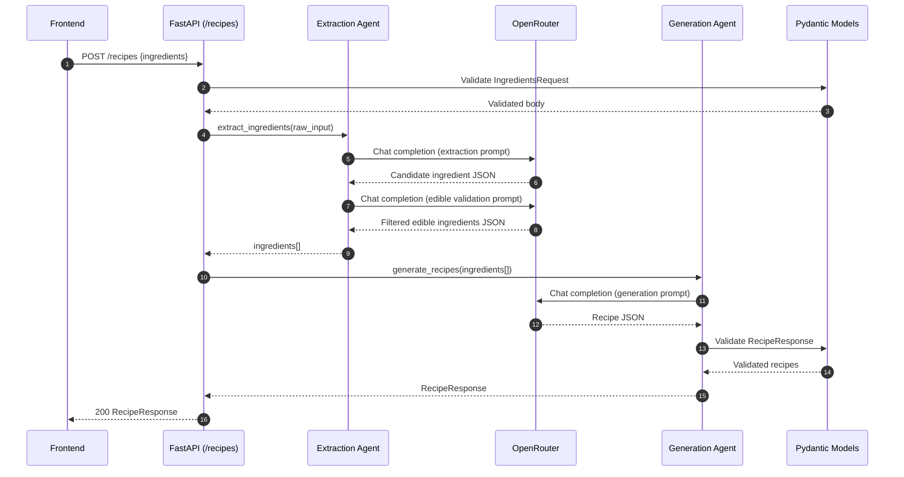
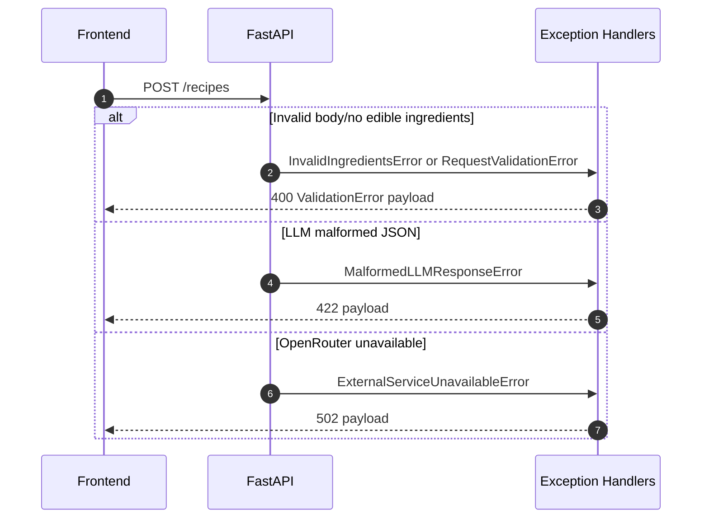
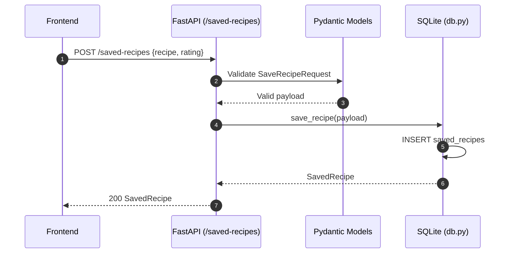

# Smart Recipe Analyzer

Smart Recipe Analyzer is a full-stack app that takes free-text ingredients, extracts edible items with AI, generates 2-3 structured recipes with nutrition data, and lets users save recipes with ratings.

## Tech Stack

- Frontend: Next.js (App Router), TypeScript
- Backend: FastAPI, Uvicorn, Pydantic v2
- LLM Provider: OpenRouter (OpenAI-compatible API)
- Database: SQLite (`backend/recipes.db`)
- Package manager (backend): `uv`
- Testing: `pytest`, `pytest-asyncio`, `httpx`

## Repository Structure

```text
FoodApp/
├── backend/
│   ├── main.py                 # FastAPI app, routes, exception handlers, startup lifecycle
│   ├── models.py               # Pydantic request/response + error schemas
│   ├── agents.py               # Extraction and generation agent pipeline
│   ├── prompts.py              # System prompts for extraction, validation, generation
│   ├── errors.py               # Custom domain exceptions mapped to HTTP responses
│   ├── db.py                   # SQLite init + save/list persistence functions
│   ├── cli.py                  # Local CLI client for backend interaction
│   ├── .env.example            # Environment variable template
│   ├── pyproject.toml          # Python deps + pytest config
│   ├── recipes.db              # SQLite database file (runtime-generated)
│   └── tests/
│       ├── conftest.py
│       ├── test_models_unit.py
│       └── test_openrouter_integration.py
├── frontend/
│   ├── app/
│   │   ├── page.tsx            # Chat page
│   │   ├── recipes/page.tsx    # Saved recipes page
│   │   ├── layout.tsx          # Global layout + navbar
│   │   └── globals.css         # Global and component styles
│   ├── components/
│   │   ├── Navbar.tsx
│   │   ├── ChatInput.tsx
│   │   ├── ChatMessage.tsx
│   │   ├── RecipeCard.tsx
│   │   ├── SaveRecipeModal.tsx
│   │   └── RecipeSkeleton.tsx
│   ├── lib/api.ts              # Frontend HTTP client wrappers
│   └── types/recipe.ts         # Frontend TypeScript types
├── INSTRUCTIONS.md
└── PLAN.md
```

## Backend Architecture

The backend follows a layered flow:

1. API route validates and parses request body with Pydantic.
2. `extract_ingredients` agent removes non-food entities and normalizes edible ingredients.
3. `generate_recipes` agent creates structured recipes that are validated by `RecipeResponse`.
4. Optional persistence APIs write/read recipes with user ratings in SQLite.
5. Custom exceptions are translated into typed, user-friendly HTTP error payloads.

### Key Backend Modules

- `main.py`
  - App bootstrapping
  - CORS setup for frontend (`localhost:3000`)
  - Lifespan startup checks (`OPENROUTER_API_KEY`) and DB init
  - Route handlers
  - Exception-to-HTTP mapping

- `agents.py`
  - `extract_ingredients(raw_input)`
    - Calls extraction prompt
    - Normalizes tokens
    - Runs strict edible validation prompt
    - Raises `InvalidIngredientsError` if nothing edible remains
  - `generate_recipes(ingredients)`
    - Calls generation prompt
    - Validates output against `RecipeResponse`

- `models.py`
  - Core schemas: `IngredientsRequest`, `Recipe`, `Nutrition`, `RecipeResponse`
  - Persistence schemas: `SaveRecipeRequest`, `SavedRecipe`, `SavedRecipeListResponse`
  - Error payload schemas: `ValidationError`, `MalformedLLMResponse`, `ExternalServiceError`

- `db.py`
  - Creates `saved_recipes` table on startup
  - Persists full recipe payload fields + `rating` and `created_at`
  - Returns hydrated `SavedRecipe` objects

## API Reference

Base URL (local): `http://127.0.0.1:8000`

### `GET /health`

Health check endpoint.

Response:

```json
{ "status": "ok" }
```

### `POST /recipes`

Generate recipes from user ingredient input.

Request:

```json
{ "ingredients": "chicken, garlic, lemon" }
```

Response (200):

```json
{
  "recipes": [
    {
      "name": "Lemon Garlic Chicken Bowl",
      "ingredients": ["chicken", "garlic", "lemon", "rice"],
      "instructions": ["..."],
      "cookingTime": "30 minutes",
      "difficulty": "Easy",
      "nutrition": {
        "calories": 480,
        "protein": "35g",
        "carbs": "40g"
      }
    }
  ]
}
```

Error responses:

- `400`: invalid input or no edible ingredients after validation
- `422`: malformed LLM response not matching schema
- `502`: OpenRouter unavailable

### `POST /saved-recipes`

Persist a generated recipe with rating.

Request:

```json
{
  "recipe": {
    "name": "Lemon Garlic Chicken Bowl",
    "ingredients": ["chicken", "garlic", "lemon", "rice"],
    "instructions": ["..."],
    "cookingTime": "30 minutes",
    "difficulty": "Easy",
    "nutrition": {
      "calories": 480,
      "protein": "35g",
      "carbs": "40g"
    }
  },
  "rating": 5
}
```

Response (200):

```json
{
  "id": 1,
  "recipe": { "name": "..." },
  "rating": 5,
  "createdAt": "2026-03-05T11:30:00.123456+00:00"
}
```

### `GET /saved-recipes`

Returns saved recipes.

Response (200):

```json
{
  "items": [
    {
      "id": 1,
      "recipe": { "name": "..." },
      "rating": 5,
      "createdAt": "2026-03-05T11:30:00.123456+00:00"
    }
  ]
}
```

## Backend Sequence Diagrams

### 1. Recipe Generation Flow (`POST /recipes`)



### 2. Error Flow (Validation and External Failures)



### 3. Save Recipe Flow (`POST /saved-recipes`)



## Environment Setup

## Prerequisites

- Python `>=3.13`
- Node.js `>=18` (recommended modern LTS)
- `pnpm`
- `uv`
- OpenRouter API key

## 1) Backend Setup

```bash
cd backend
uv sync
```

Create env file:

```bash
cp .env.example .env
```

Set real key in `backend/.env`:

```env
OPENROUTER_API_KEY=your_real_openrouter_key
```

Run backend:

```bash
uv run main.py
```

Backend URL: `http://127.0.0.1:8000`

## 2) Frontend Setup

```bash
cd frontend
pnpm install
pnpm dev
```

Frontend URL: `http://localhost:3000`

Optional frontend env (`frontend/.env.local`):

```env
NEXT_PUBLIC_API_URL=http://127.0.0.1:8000
```

## 3) CLI Setup (Optional)

From `backend/` while backend is running:

```bash
uv run cli.py
```

## Testing

From `backend/`:

Unit tests only:

```bash
uv run pytest tests/test_models_unit.py -v
```

Live OpenRouter integration tests (no mocks):

```bash
uv run pytest tests/test_openrouter_integration.py -v
```

Run all tests:

```bash
uv run pytest -v
```

## Notes

- Integration tests require a real `OPENROUTER_API_KEY`.
- Saved recipes are persisted in local SQLite file `backend/recipes.db`.
- CORS currently allows frontend origin `http://localhost:3000`.
